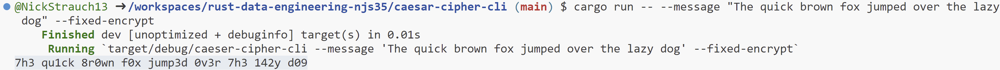
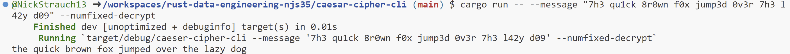

[](https://github.com/nogibjj/rust-data-engineering/actions/workflows/lint.yml)
[](https://github.com/nogibjj/rust-data-engineering/actions/workflows/tests.yml)

# Week 7 Mini-Project Rust CLI

##  Modifying a Rust CLI Tool
I added a new encryption/decryption type to the caesar-cipher-cli tool. My encryption replaces English characters with their integer look-a-likes (when applicable). For example: A --> 4, B --> 8, o --> 0, i --> 1, s --> 5, ...

I created this new encryption type by creating two new functions in the caesar-cipher-cli/src/lib.rs file. These two functions ``fixed_encrypt`` and ``fixed_decrypt`` replace a fixed set of English characters with their integer look-a-likes.

I then modified caesar-cipher-cli/src/main.rs to include two new arguments: ``fixed_encrypt`` and ``numfixed_decrypt``. Both of these arguments were type bool. When the user specifies one of these arguments in the cli tool, their corresponding lib.rs functions are called.

## User guide

1. Change to the caesar-cipher-cli directory
``cd caesar-cipher-cli``
2. Run 
``cargo build``
3. Encrypt a message with ``cargo run -- --message "<your message>" --fixed-encrypt``

4. Decrypt a message with ``cargo run -- --message "<your message>" --numfixed-decrypt``


## Makefile

Each subdirectory project uses this style to make it easy to test and run

```
format:
	cargo fmt --quiet

lint:
	cargo clippy --quiet

test:
	cargo test --quiet

run:
	cargo run 

all: format lint test run
```

